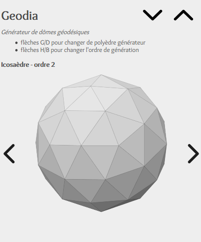

GeoProj
=======

A nice viewer for [Gedoesic grids][GeodesicGridsWikipedia].

**[See it here!](https://lenaindelaforetmagique.github.io/Geodia/)**

## Screenshot!

## Controls

### Mouse
- click & move : change point of view.
- wheel : zoom in/out.
- CTRL + click & move : change position of light.
- SHIFT + click & move : change perspective ratio.

### Keyboard
- left/right arrows to change polyedra generator.
- up/down arrows to change order of generation.
- pageUP/pageDOWN : change opacity.

### Touch
- same as simple click & move.

License
=======

_Geodia_ is licensed under the [MIT License](LICENSE). Distribute and modify at will!

Overlock font from [Google Fonts](https://fonts.google.com/specimen/Overlock), distributed under the [SIL Open Font License, 1.1](http://scripts.sil.org/cms/scripts/page.php?site_id=nrsi&id=OFL).

[GeodesicGridsWikipedia]:https://en.wikipedia.org/wiki/Geodesic_grid
